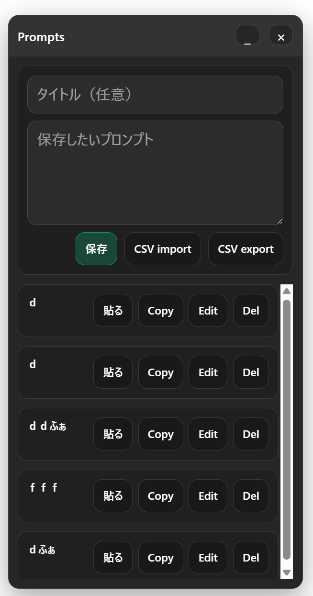

# ChatGPT Prompt Floating UI

ChatGPTの入力欄のそばに、保存済みプロンプトを扱うためのフローティングUIを表示するChrome拡張機能です。

    

## 特長
- プロンプトの保存・一覧表示
- クリックで入力欄へ貼り付け / クリップボードへコピー
- CSVのインポート / エクスポート
- UIの最小化と位置保存
- ショートカット: `Ctrl+Shift+L` で最小化切り替え

## インストール
1. Chromeの拡張管理 (`chrome://extensions/`) を開く
2. 右上の「デベロッパー モード」をオン
3. 「パッケージ化されていない拡張機能を読み込む」からこのフォルダを選択
4. `chatgpt.com` / `chat.openai.com` を開く

## 使い方
- 右下のUIにプロンプトを入力し、「保存」を押す
- 保存済みの項目から `Use` で貼り付け、`Copy` でコピー、`Del` で削除
- `CSV import` / `CSV export` で一括インポート・エクスポート
- ヘッダー部分をドラッグして位置を移動（位置は保存）

## CSVフォーマット
- ヘッダーあり: `id,title,text,createdAt`
- ヘッダーなしも読み込み可能
- `text` が空の行はスキップ

## 構成
- `manifest.json`: 拡張設定
- `composer.js`: 入力欄の取得/設定
- `store.js`: 保存データの読み書き
- `csv.js`: CSV入出力
- `ui/ui.js`, `ui/ui.css`: フローティングUI
- `content.js`: UI初期化